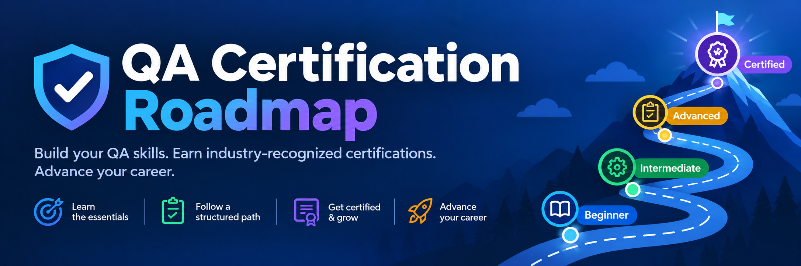

# QA Certification Roadmap

**Find the software testing certification that fits your work, and see what comes next.**

The roadmap maps software testing certifications from ISTQB, TMAP, Tricentis, Robot Framework, A4Q, OpenText, ICAgile, OffSec, GIAC, PortSwigger, IAAP and the TMMi Foundation. Each one is placed in a **domain** (what it proves) and a **level** (how much experience it expects). Pick your domain, start at L1 and climb.

Looking for AI certifications beyond testing? See the [AI Certification Roadmap](https://elliotborryn.github.io/ai-certification-roadmap/).

## What you can do

- **Browse by domain and level** in the Roadmap view, or as cards in the List view. On phones, the page always uses the List view.
- **Search** by exam code, name, vendor or domain. Press <kbd>/</kbd> to jump to the search box.
- **Filter** to certifications launched in 2025 or later, or to a single vendor.
- **Open any certification** to see what it covers, its prerequisites, the exam fee, its status and a link to the vendor's page.
- **See fees in your currency.** Choose from 17 currencies (see [Fees and currencies](#fees-and-currencies)).
- **Switch between light and dark themes.** By default the page follows your system setting.

## How certifications are placed

| Domain | What it covers |
|---|---|
| Test Analysis & Design | Testing foundations, test design techniques, acceptance testing |
| Test Automation | Automation tools, engineering and strategy, API test automation |
| Agile & DevOps Testing | Quality in agile teams, DevOps pipelines and continuous delivery |
| Specialist Testing | Performance, mobile, and industries such as automotive and finance |
| Security Testing | Security and penetration testing |
| Accessibility & Usability | Accessibility (WCAG) and usability testing |
| AI Testing | Testing AI systems, and testing with AI |
| Test Management & Leadership | Test management, strategy and process improvement |

| Level | Meaning |
|---|---|
| **L1** Foundation | Where everyone starts; no experience needed |
| **L2** Specialist | One focused topic, built on the foundation |
| **L3** Advanced | Experienced testers deepening a role |
| **L4** Expert | Senior testers and test leaders; several years of experience required |

A certification goes in the domain it *proves*, not the one its vendor belongs to. ISTQB certifications follow ISTQB's own structure (Foundation, Specialist, Advanced, Expert). Other certifications are placed by the experience the vendor recommends, not by their title. The full rules, including tie-breakers, are in [PLACEMENT.md](PLACEMENT.md).

## Accuracy and sources

Each certification is marked as either **checked on the vendor's page** or **from industry reports**. The page footer shows when the data was last reviewed. Exam fees change and vary by region and membership, so always confirm on the vendor's page before you book. ISTQB fees are set by national exam boards and differ per country, so ISTQB certifications show "Varies by exam board".

Retired certifications and ones being phased out, such as QAI's CSTE and ISTQB CTFL-AT, are left out and listed in the footer instead.

### Fees and currencies

Fees are stored as US-dollar exam prices. The currency picker converts them in your browser using daily European Central Bank exchange rates from [Frankfurter](https://frankfurter.dev), a free service that needs no account. Converted fees are marked with `≈`, and the card still shows the US price. Some vendors set their own regional prices, so the converted amount is a guide rather than a quote.

The default currency comes from your browser's region, for example British English → GBP and German → EUR. Anything else defaults to US dollars, which are the vendors' own list prices. The page remembers your choice. If the rates can't be loaded, fees are shown in USD.

## Suggest a certification

Missing one, or spotted an outdated fee? [Open a suggestion](https://github.com/elliotborryn/qa-certification-roadmap/issues/new?template=suggest-certification.yml), or use the **Suggest one** link at the bottom of the page. Every suggestion is checked against the vendor's official page before it's added.

---

Inspired by [Dragkob's Security Certification Roadmap](https://github.com/Dragkob/Security-Certification-Roadmap).

© 2026 Elliot ([@elliotborryn](https://github.com/elliotborryn)). All rights reserved.
